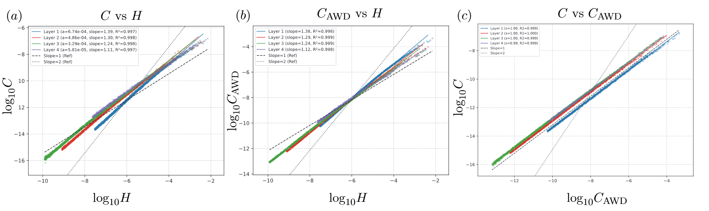
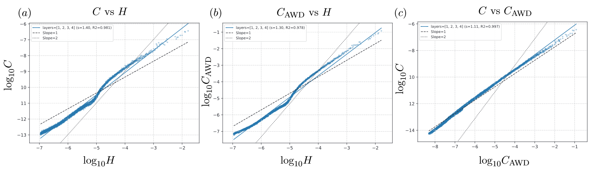
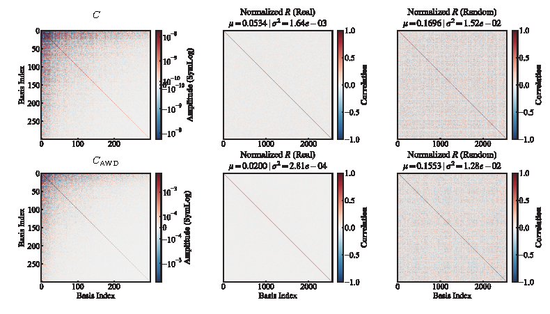
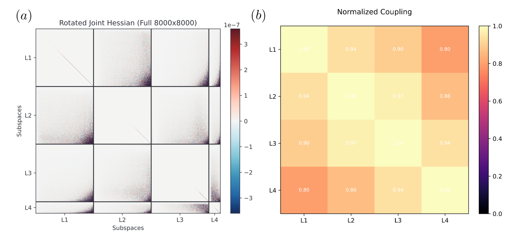

## Supplementary Figures

All experiments use a deeper MLP (784–50–50–50–50–10) trained on MNIST with CE loss for 100 epochs with 100% training accuracy.

### Figure 1: Per-layer Covar–H loglog plot

**Figure 1.** Per-layer $Covar$–$H$ spectral analysis. Log-log plots (in Hessian eigenbasis) of the diagonal elements of the empirical noise covariance $Covar$ (left) and the AWD-based $H_2 = \frac{2C}{\sigma_w^2} = \mathbb{E}_p \left[ \sum_{m} (\kappa_m^{(p)})^2 (\mathbf{u}_m^{(p)} \cdot \mathbf{v}_i)^2 \right]$ (right) against the Hessian $H$, computed separately for each layer. Top row: data points are mean-centered and vertically shifted for visualization, which isolates the scaling relationship from absolute magnitude differences across layers. Bottom row: raw data plotted directly. Each layer exhibits a clean power-law relationship $C \propto H^\gamma$ with $R^2 > 0.99$. The magnitude ranges of the diagonal elements of $C$ and $H$ overlap strongly across layers. The fitted exponent $\gamma$ decreases from $\approx 1.39$ (Layer 1, blue) to $\approx 1.11$ (Layer 4, purple), but remains within $(1,2)$ across all layers, consistent with our theoretical prediction. The AWD-based $H_2$ reproduces the empirical slopes faithfully.

### Figure 2: Multi-layer (Whole-model) Covar vs. Hessian and H₂d vs. Hessian

**Figure 2.** Multi-layer (Whole-model) $Covar$ vs. Hessian and $H_{2,d}$ vs. Hessian. Log-log plots (in Hessian eigenbasis) of the diagonal elements. Left: empirical covariance. Right: AWD-based $H_{2,d} = \frac{2C}{\sigma_w^2} = \mathbb{E}_p \left[ \sum_{m} (\kappa_m^{(p)})^2 (\mathbf{u}_m^{(p)} \cdot \mathbf{v}_i)^2 \right]$. Unlike the per-layer plots, the whole-model log-log curves do not follow a single clean linear relationship: the local slope varies across the eigenvalue range.

### Figure 3: Empirical C vs. AWD-based C (Whole-model level)

**Figure 3.** Empirical $C$ vs. AWD-based $C$ (Multi-layer (Whole-model) level). Log-log plot (in Hessian eigenbasis) of the diagonal elements of the empirical covariance Covar against the AWD-based $H_{2,d}$. The fitted slope is $\approx 1.11$ with $R^2 \approx 0.997$, indicating near-perfect agreement. This demonstrates that Theorem 3.4 faithfully captures the empirical covariance structure at the whole-model level, even though neither $Covar$ nor $H_{2,d}$ follows a clean power law against $H$ (cf. Figure 2).

### Figure 4: Approximate commutativity [C, H] ≈ 0 at the whole-model level

**Figure 4.** Approximate commutativity $[C, H] \approx 0$ at the whole-model level. The same as Fig 1 in the paper, but for the whole-model (multi-layer) level instead of per-layer. Top row: empirical covariance (Covar). Bottom row: AWD-based approximation $H_{2,d}$. (a) Left column: the matrix represented in the Hessian eigenbasis. (b) Middle column: the scale-invariant correlation matrix $R_{\mathrm{real}}$, normalized by diagonal elements (mean $\mu$ and variance $\sigma^2$ shown). (c) Right column: the randomized baseline $R_{\mathrm{rand}}$, constructed by randomly rotating the matrix while preserving its eigenvalue spectrum. For both Covar and $H_{2,d}$, the true-eigenbasis correlation $R_{\mathrm{real}}$ has substantially smaller mean and variance than the randomized baseline $R_{\mathrm{rand}}$, confirming that approximate commutativity holds at the multi-layer (whole-model) level.
